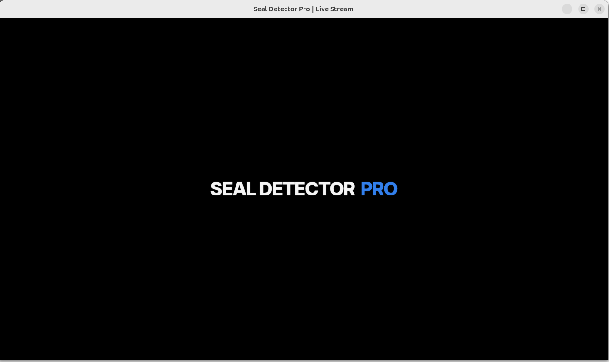
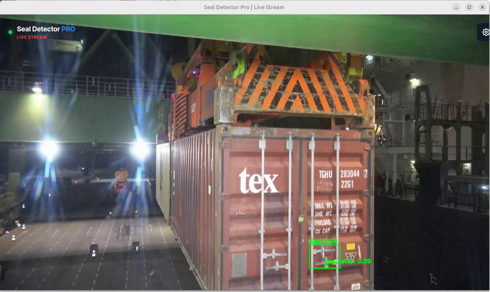
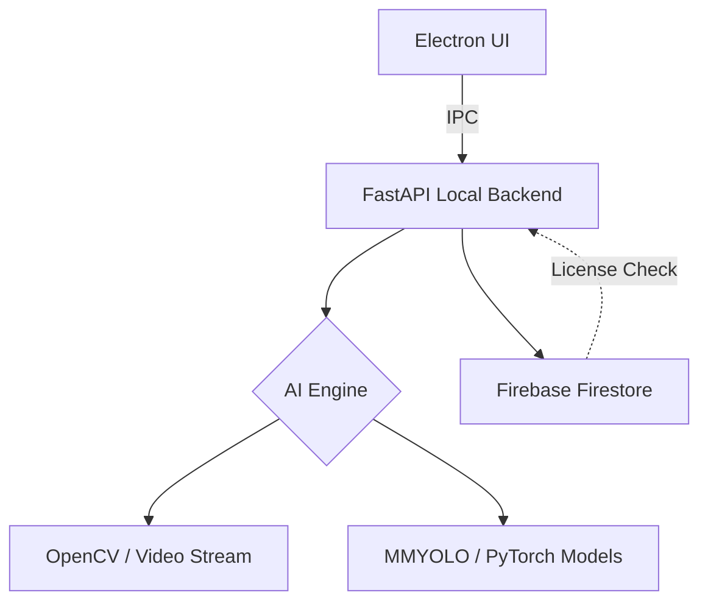

# Seal Detector Pro

> **Professional AI-powered container door security seal inspection for Linux.**

[](https://ubuntu.com/)
[](https://fastapi.tiangolo.com/)
[](https://www.electronjs.org/)
[](https://pytorch.org/)
[](##-license)

<p align="center">
  
  
</p>

<p align="center">
  <i>The interface is designed for high-visibility in industrial environments (Ports & Terminals).</i>
</p>

---

## 📖 Overview

**Seal Detector Pro** is a high-performance Linux desktop application designed for real-time detection and inspection of container door security seals. Ideal for ports, logistics hubs, and cargo terminals, it replaces manual checks with consistent, AI-driven verification.

### Key Features

- 🔐 **Real-Time Detection:** Automatic identification of security seals via AI.
- 🎥 **Versatile Input:** Supports USB Webcams, RTSP IP Cameras, and MJPEG streams.
- ⚡ **High Performance:** Native GPU acceleration (NVIDIA CUDA) for low-latency inference.
- 📦 **Desktop Native:** Run as a standalone `.AppImage` or `.deb` — no browser or Python setup required for end-users.
- 🌐 **Hybrid Licensing:** Remote license validation with offline grace periods via Firebase.

> [!NOTE]
> **Release Status:** The `.AppImage` and `.deb` installers are currently in final testing and will be available for download in the [Releases](https://github.com/mani9441/seal-detector-pro/releases) section very soon. Stay tuned!

---

## Architecture & Tech Stack



- **Frontend:** Electron, HTML5, CSS3.
- **Backend:** FastAPI (Python), PyInstaller.
- **Computer Vision:** OpenCV, PyTorch, MMDetection.
- **Infrastructure:** Firebase (Auth/Licensing).

---

## 📂 Project Structure

```text
seal-detector-pro/
├── electron/           # Main process & desktop config
├── frontend/           # UI Assets (HTML/JS/CSS)
├── backend_app.py      # Core FastAPI logic
├── configs/            # AI Model configurations (Internal)
├── requirements.txt    # Python dependencies
└── README.md           # Documentation

```

> [!IMPORTANT]
> Large AI model weights (`.pth` / `.onnx`) are excluded from the repository to maintain performance.

---

## ⬇️ Downloads

| Package Type                | Status         | Link                                          |
| :-------------------------- | :------------- | :-------------------------------------------- |
| **AppImage** (Portable)     | ⏳ Coming Soon | [Check Releases](https://github.com/mani9441) |
| **Debian Installer** (.deb) | ⏳ Coming Soon | [Check Releases](https://github.com/mani9441) |

> [!TIP]
> Click the **"Watch"** button at the top of this repository to be notified the moment the first version is released.

---

## 🚀 Installation & Usage

### Option 1: AppImage (Portable)

1. Download `Seal-Detector-Pro.AppImage`.
2. `chmod +x Seal-Detector-Pro.AppImage`
3. Execute: `./Seal-Detector-Pro.AppImage`

### Option 2: Debian Installer

```bash
sudo apt install ./seal-detector-pro_amd64.deb

```

---

## 💻 System Requirements

| Component        | Requirement                                      |
| ---------------- | ------------------------------------------------ |
| **OS**           | Ubuntu 20.04+ or Debian-based Linux              |
| **GPU**          | NVIDIA GPU (Recommended for CUDA acceleration)   |
| **Architecture** | x86_64                                           |
| **Network**      | Internet required for initial license activation |

---

## 📄 Licensing & Terms

<details>
<summary><b>Click to expand License Details (Proprietary)</b></summary>

### Ownership

Seal Detector Pro is **Proprietary Software**. All intellectual property rights belong to the author.

### Restrictions

- No redistribution or reselling without explicit permission.
- No reverse engineering or tampering with the license validation.
- Usage is limited to the licensed period and number of seats.

</details>

---

## 👨‍💻 Author

<p align="left">

</p>

**Manikanta Kalyanam** _Project Maintainer & Lead Developer_

[](https://github.com/mani9441)
[](mailto:k.manikanta9441@gmail.com)
